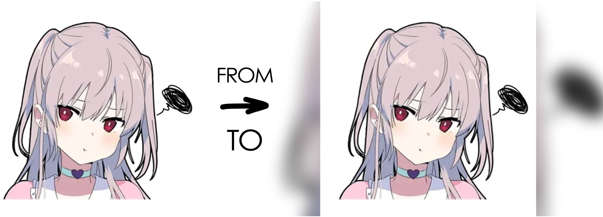

Telegram bot for crop and blur photos
=====================================
Bot change image resolution to 16:9 and add blured part of this photo on the background
Usualy use for movies' posters
Examples:

|  	   |      	|  	|
|------------------------      |------------------------ 	    |----------------------	    |

Installing
==========
For instalation you need Python3 or later versions
Also require this libraries:

.. code:: shell
    $ pip install aiogram
    $ pip install pillow

Firstly, open ``config.py`` and paste there **bot token** from @BotFather
You can also change **blurValue**. It affects the strength of the blur. For default, it's 10. I recommend values **from 10 to 15**
And finally start ``main.py`` file to start the bot. You can also set auto-restart, for example through **systemd** service, if you work with linux

Usage
=====
Just send an **image** or a **link to image** to bot and it will answer with new image
You can also change **mode**. There is two variants: **original size** or **croping to 900:506 pixels**
By default it set **original size** mode, but you can change it by ``/mode`` command. This mode set separately for each user

Enjoy this simple bot for your needs! :)
